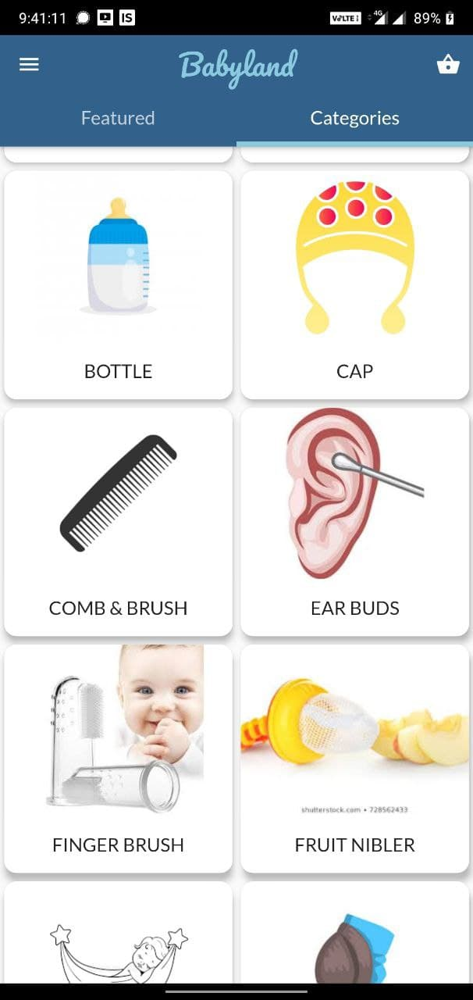
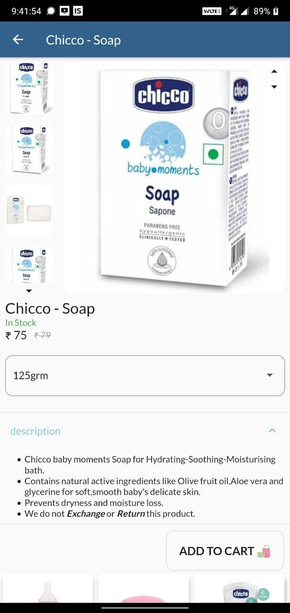
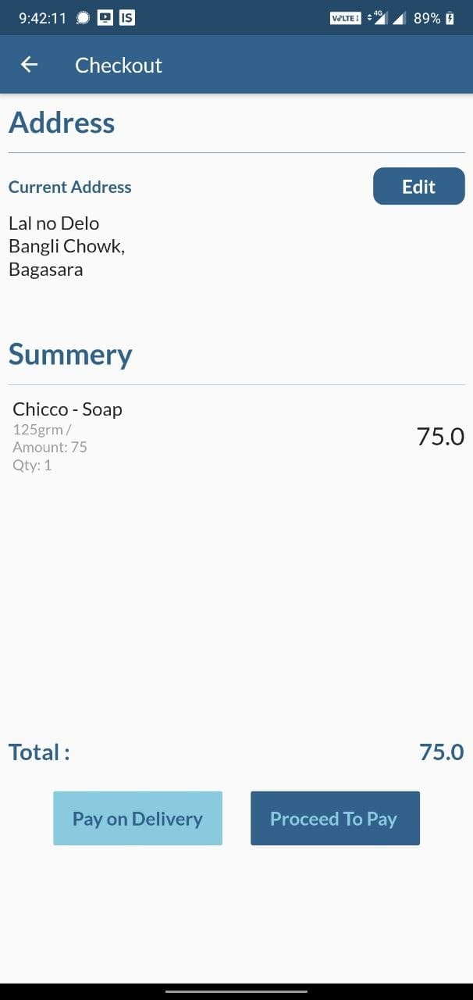
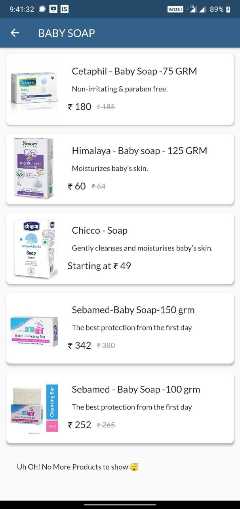
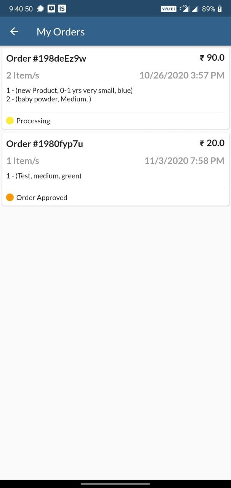

<!-- PROJECT LOGO -->

<p align="center">
  <h3 align="center">Babyland - Online Shopping</h3>
  <p align="center">
    An E-commerce app backed with WooCommerce API
   </p>
</p>

<!-- ABOUT THE PROJECT -->
## About The Project

### Built With

* Flutter
* Firebase
* WooCommerce API
* RazorPay

## Screenshots

<p align="center">
  
  
  
  
  
  
</p>


<!-- GETTING STARTED -->
## Getting Started
Enter Woocommerce API config as shown below,

### Prerequisites

To run it, just create a **config.dart** file under ***/lib*** folder and assign your API Details as below.
* config.dart
  ```sh
    //WooCommerce
	const liveUrl = <ENTER URL>;
	const liveConsumerKey = <ENTER CONSUMER KEY>;
	const liveConsumerSecret = <ENTER CONSUMER SECRET>;
	
	const List liveAPI = [liveUrl,liveConsumerKey,liveConsumerSecret];
	
	//Razorpay
	const test_pay = <RAZORPAY TEST KEY>; //rzp_test_xxxxxx
	const live_pay = <RAZORPAY LIVE KEY>; //rzp_live_xxxxxx
	
	//Stripe
	const publishable_live =<LIVE PUBLISHABLE KEY> //pk_live_xxxxxx
	const publishable_test =<TEST PUBLISHABLE KEY> //pk_test_xxxxxx
	const secret_live = <LIVE SECRET KEY> //sk_live_xxxxxx
	const secret_test = <TEST SECRET KEY> //sk_test_xxxxxx
  ```

<!-- CONTACT -->
## Contact

Your Name - [@sohil_bhanani](https://twitter.com/sohil_bhanani) - sbhananis@gmail.com

Project Link: [https://github.com/SohilBhanani/babyland_rajkot](https://github.com/SohilBhanani/babyland_rajkot)

[product-screenshot]: images/screenshot.png
